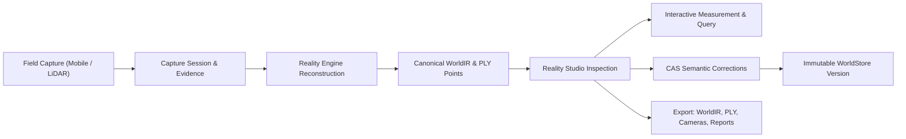

# Reality Engine & Reality Studio — Comprehensive User Guide

> **Official Desktop Workstation Manual**  
> *Targeted at surveyors, spatial engineers, BIM specialists, architects, and technical analysts.*

---

# Table of Contents
1. [Part 1 — Product Orientation & Conceptual Framework](#part-1--product-orientation--conceptual-framework)
2. [Part 2 — User Personas & Complexity Separation](#part-2--user-personas--complexity-separation)
3. [Part 3 — Workspace Architecture & Visual Tour](#part-3--workspace-architecture--visual-tour)
4. [Part 4 — The 9 Left Navigation Panels](#part-4--the-9-left-navigation-panels)
5. [Part 5 — 3D Spatial Viewport in Depth](#part-5--3d-spatial-viewport-in-depth)
6. [Part 6 — Adaptive Entity Inspector](#part-6--adaptive-entity-inspector)
7. [Part 7 — Field Evidence Management & Provenance](#part-7--field-evidence-management--provenance)
8. [Part 8 — Capture Sessions Lifecycle](#part-8--capture-sessions-lifecycle)
9. [Part 9 — Room Construction Pipeline](#part-9--room-construction-pipeline)
10. [Part 10 — Versions & WorldStore CAS](#part-10--versions--worldstore-cas)
11. [Part 11 — Entity Correction & Semantic Editing](#part-11--entity-correction--semantic-editing)
12. [Part 12 — Version Comparison & Diff Engine](#part-12--version-comparison--diff-engine)
13. [Part 13 — Spatial Query Engine](#part-13--spatial-query-engine)
14. [Part 14 — Spatial Topology & Building Connectivity](#part-14--spatial-topology--building-connectivity)
15. [Part 15 — Places & Camera Bookmarks](#part-15--places--camera-bookmarks)
16. [Part 16 — Canonical Export & CAD/BIM Interoperability](#part-16--canonical-export--cadbim-interoperability)
17. [Part 17 — Large Worlds & Level-of-Detail (LOD)](#part-17--large-worlds--level-of-detail-lod)
18. [Part 18 — WebGL Context Resilience & GPU Recovery](#part-18--webgl-context-resilience--gpu-recovery)
19. [Part 19 — Comprehensive Error Recovery ("If Something Goes Wrong")](#part-19--comprehensive-error-recovery-if-something-goes-wrong)
20. [Part 20 — Data Trust: Observed vs Derived vs Inferred](#part-20--data-trust-observed-vs-derived-vs-inferred)
21. [Part 21 — Step-by-Step Practical Workflows (A through J)](#part-21--step-by-step-practical-workflows-a-through-j)
22. [Part 22 — Human-Factor & Usability Task Audit](#part-22--human-factor--usability-task-audit)
23. [Part 23 — Discoverability & Terminology Audit](#part-23--discoverability--terminology-audit)
24. [Part 24 — User Required Skills Assessment](#part-24--user-required-skills-assessment)
25. [Part 25 — Accessibility Conformance](#part-25--accessibility-conformance)
26. [Part 26 — Known Limitations & System Boundaries](#part-26--known-limitations--system-boundaries)
27. [Part 27 — Documentation Verification Matrix](#part-27--documentation-verification-matrix)

---

# Part 1 — Product Orientation & Conceptual Framework

### What Reality Studio Is
**Reality Studio** is an interactive spatial engineering workstation designed for inspecting, verifying, measuring, and correcting reconstructed physical environments. Unlike standard artistic 3D software (such as Blender) or generic geospatial map viewers, Reality Studio interfaces directly with **Reality Engine**'s canonical spatial model.

Every visible line, boundary box, surface, point, and dimension rendered inside Reality Studio originates strictly from verified sensor data and algorithmic reconstruction. Reality Studio adheres to an **honest representation policy**:
* It never synthesizes fake geometry to make an incomplete scan look "finished".
* It never fabricates arbitrary default confidence scores (e.g., defaulting to 50% or 100%).
* It never masks reconstruction or alignment failures behind decorative visual placeholders.



### Core Concepts Explained Simply

* **World:** A persistent, physically bounded digital twin of a real-world location (e.g., an office floor, a chemical lab, or a construction site). A World contains metric coordinate bounds, storeys, rooms, walls, doors, structural columns, furniture entities, and 3D point clouds.
* **Session:** A specific field capture event conducted by a mobile phone, tablet, or drone. A session bundles raw photos, videos, LiDAR depth files, and IMU pose trajectories uploaded during a site visit.
* **Evidence:** An individual physical observation collected in the field—most commonly an image frame or depth frame paired with sensor metadata (focal length, timestamps, GPS/IMU poses, and sensor serials).
* **Reconstruction:** The algorithmic pipeline that turns unstructured 2D photos and depth maps into a coherent 3D metric model. This combines Structure-from-Motion (SfM), Multi-View Stereo (MVS), semantic segmentation, and volumetric room extraction.
* **WorldIR (World Intermediate Representation):** The canonical JSON schema specifying the entire reconstructed environment. It defines the hierarchical tree (Site $\to$ Building $\to$ Storeys $\to$ Spaces $\to$ Objects), metric 3D oriented bounding boxes ($L \times W \times H$), centroid positions $(X, Y, Z)$, semantic labels, adjacency relations, and statistical confidence scores.
* **WorldStore CAS (Compare-And-Swap):** The transactional storage engine that keeps WorldIR revisions immutable. Every manual edit creates a new version referencing its parent commit hash. If another user commits changes in between, the CAS mechanism prevents silent data overwrites.

---

# Part 2 — User Personas & Complexity Separation

To serve users with varying technical backgrounds without artificial simplification, Reality Studio separates concepts into three explicit tiers:

```
+-------------------------------------------------------------------------------+
|  TIER 1: NORMAL COMPUTER USER CONCEPTS                                        |
|  Buildings · Rooms · Walls · Floors · Photographs · Measurements · Export     |
+-------------------------------------------------------------------------------+
|  TIER 2: PROFESSIONAL SPATIAL CONCEPTS (Architects, BIM Specialists, Surveyors)|
|  Point Clouds · Metric Calibration · Storeys · Bounding Dimensions · Topology |
+-------------------------------------------------------------------------------+
|  TIER 3: SYSTEM ENGINEERING CONCEPTS (Engineers, Developers)                  |
|  WorldIR Schema · WorldStore CAS · SfM Bundle Adjustment · WebGL Shaders / LOD|
+-------------------------------------------------------------------------------+
```

### Persona Needs

| Persona | Primary Goal | What They Need to Know | What They Can Safely Ignore |
| :--- | :--- | :--- | :--- |
| **A. Normal Computer User** | View a building scan and verify what is inside. | How to orbit, pan, zoom, click rooms, and view measurements. | WorldIR JSON, CAS commit hashes, camera intrinsic matrices. |
| **B. Architect / BIM Specialist** | Verify room dimensions, floorplans, and clear openings. | Storey isolation, wall toggling (`W`), two-point laser measurement (`M`), topological space adjacency. | Backend pipeline subprocesses and WebGL shader striding. |
| **C. Reality-Capture / Surveyor** | Verify point cloud density, registration quality, and sensor provenance. | Camera frustums (`3`), registration ratios ($M/N$ cameras), scale calibration state, evidence tracing. | Client-side React component hierarchy. |
| **D. Software Engineer** | Integrate APIs, automate pipelines, and maintain spatial data integrity. | REST endpoints, WorldIR schema v1/v2, WorldStore CAS concurrency, WebGL context loss recovery. | Basic architectural classification principles. |

---

# Part 3 — Workspace Architecture & Visual Tour

Reality Studio is organized into an ergonomic 3-column workstation:

```
+---------------------------------------------------------------------------------------------------+
|  REALITY STUDIO HEADER: World ID · Coordinate Frame · Version · 3D/Map · Commands · Tools · Panels |
+--------------------+--------------------------------------------------------+--------------------+
|  LEFT NAV PANEL    |  3D SPATIAL VIEWPORT / GEOSPATIAL MAP                  |  ADAPTIVE          |
|  (280px, [ [ ])    |  (Interactive WebGL2 Canvas)                           |  INSPECTOR         |
|                    |                                                        |  (340px, [ ] ])    |
|  [9 Tabs]          |  • Orbital Camera Navigation                           |                    |
|  1. Worlds         |  • Real-time Metric Point Cloud & Meshes               |  • Entity Identity |
|  2. Sessions       |  • Display Toggles: Pts, Ent, Cam, Walls, Topo, Grid   |  • Classification  |
|  3. Evidence       |  • True North Metric ENU Compass Widget                |  • Metric Bounds   |
|  4. Hierarchy      |  • Precision Laser Measurement Tool (M)                |  • Confidence &    |
|  5. Topology       |  • Spatial Query Isolation Visuals                     |    Uncertainty     |
|  6. Places         |                                                        |  • CAS Corrections |
|  7. Bookmarks      |                                                        |  • Trace Evidence  |
|  8. Versions       |                                                        |                    |
|  9. Query          |                                                        |                    |
+--------------------+--------------------------------------------------------+--------------------+
|  BOTTOM TELEMETRY CONSOLE (32px, [ \ ]): Coordinate System · Selection · Grid Reference · Version  |
+---------------------------------------------------------------------------------------------------+
```

### Visual Tour of Current UI


*Figure 1: Initial Reality Studio workstation displaying the honest empty state when a world has not yet been compiled.*


*Figure 2: Hierarchy panel allowing single-click storey isolation and structural inspection.*


*Figure 3: Adaptive Inspector showing physical dimensions, centroid position, and confidence metrics.*


*Figure 4: Precision 3D distance ruler displaying Euclidean distance and axis-aligned deltas.*

---

# Part 4 — The 9 Left Navigation Panels

The Left Navigation Panel (`WorldNavPanel.tsx`) contains 9 canonical tabs:

```
[Worlds] [Sessions] [Evidence] [Hierarchy] [Topology] [Places] [Bookmarks] [Versions] [Query]
```

### 1. Worlds Tab
* **WHAT DO I CLICK?** Click on any World card in the list.
* **WHAT SHOULD I SEE?** The 3D scene reloads, streaming the selected world's point cloud, mesh, and entities.
* **WHAT DOES IT MEAN?** Worlds are discrete physical sites. Switching worlds clears all transient filters and selections.
* **WHAT DO I DO NEXT?** Press `F` to frame the new world.

### 2. Sessions Tab
* **WHAT DO I CLICK?** Click on any capture session row.
* **WHAT SHOULD I SEE?** Session metadata, attached camera count, capture date, and status badge (`completed`, `processing`, `draft`).
* **WHAT DOES IT MEAN?** Sessions represent individual scanning runs in the field.
* **WHAT DO I DO NEXT?** Click **Construction** in the top header to run reconstruction on this session.

### 3. Evidence Tab
* **WHAT DO I CLICK?** Click on an image thumbnail in the grid.
* **WHAT SHOULD I SEE?** High-resolution image preview, sensor EXIF metadata, and camera serial number.
* **WHAT DOES IT MEAN?** Evidence items are raw field observations.
* **WHAT DO I DO NEXT?** Click **Trace in 3D** to fly the viewport camera to where that photo was taken.

### 4. Hierarchy Tab
* **WHAT DO I CLICK?** Expand the tree (Site $\to$ Building $\to$ Storeys $\to$ Spaces $\to$ Objects) and click a storey or room.
* **WHAT SHOULD I SEE?** Clicking a storey dims all other floors in 3D. Clicking a room highlights its oriented boundary box.
* **WHAT DOES IT MEAN?** The hierarchy represents the architectural spatial decomposition of the building.
* **WHAT DO I DO NEXT?** Press `W` to peel walls, or click **Isolate Space** to focus on one room.

### 5. Topology Tab
* **WHAT DO I CLICK?** Click on an adjacency relationship pair in the list.
* **WHAT SHOULD I SEE?** In 3D, a connection line illuminates connecting the centroids of the two adjacent rooms.
* **WHAT DOES IT MEAN?** Topological connections show how spaces connect functionally through doors or boundaries.
* **WHAT DO I DO NEXT?** Verify that emergency egress routes and door portals match building drawings.

### 6. Places Tab
* **WHAT DO I CLICK?** Click on any user-defined waypoint or zone.
* **WHAT SHOULD I SEE?** The 3D camera glides to center on that physical coordinate.
* **WHAT DOES IT MEAN?** Places are named coordinate locations (e.g., "Main Electrical Room", "North Fire Exit").
* **WHAT DO I DO NEXT?** Inspect equipment or architectural features at that location.

### 7. Bookmarks Tab
* **WHAT DO I CLICK?** Click **Add Bookmark** to save the current camera view, or click a saved bookmark card.
* **WHAT SHOULD I SEE?** The camera animates smoothly to the saved position and target angle.
* **WHAT DOES IT MEAN?** Bookmarks record exact camera poses for recurring audit inspections.
* **WHAT DO I DO NEXT?** Use bookmarks during client presentations or structural verification walkthroughs.

### 8. Versions Tab
* **WHAT DO I CLICK?** Click on any two version commits, then click **Compare Versions**.
* **WHAT SHOULD I SEE?** The **Version Diff Modal** opens showing added, modified, and removed entities.
* **WHAT DOES IT MEAN?** Reality Engine tracks every modification as an immutable commit in WorldStore.
* **WHAT DO I DO NEXT?** Inspect before-and-after attribute changes and locate altered objects in 3D.

### 9. Query Tab
* **WHAT DO I CLICK?** Enter text in the search input, select an entity type, or drag the confidence slider.
* **WHAT SHOULD I SEE?** Entities not matching your criteria are dimmed in 3D in real time.
* **WHAT DOES IT MEAN?** The query engine lets you visually isolate specific asset classes or low-confidence detections.
* **WHAT DO I DO NEXT?** Click **Reset Query** to restore full building visibility.

---

# Part 5 — 3D Spatial Viewport in Depth

The central viewport is powered by an optimized Three.js WebGL2 spatial rendering engine (`three-scene.ts`).

### Navigation Controls & 4-Pixel Discrimination
* **Orbit (Tumble):** Hold `Left-Click` and drag. Movement threshold ($> 4\text{px}$) distinguishes intentional orbiting from clicking.
* **Pan (Translate):** Hold `Right-Click` and drag horizontally or vertically.
* **Zoom (Dolly):** Spin `Mouse Wheel`. Any wheel interaction immediately cancels running camera animations.
* **Select Entity:** Stationary `Left-Click` ($\le 4\text{px}$). Raycasts to nearest entity. Dimmed entities on inactive storeys cannot be selected.
* **Frame (`F`):** Centers view on selected entity, or full world extent if nothing is selected.
* **Cancel / Deselect (`Escape`):** Cancels measurement mode $\to$ exits space isolation $\to$ clears selection.

### Layer Toggles & Shortcuts

| Key | Layer Name | Default | Function |
| :---: | :--- | :---: | :--- |
| **`1`** | **Point Cloud** | ON | Toggles LiDAR and photogrammetric 3D point cloud. |
| **`2`** | **Semantic Entities** | ON | Toggles 3D bounding boxes, surfaces, and entity labels. |
| **`3`** | **Cameras** | ON | Toggles physical camera frustum cones and orientations. |
| **`W`** | **Walls** | ON | Peels back interior and exterior walls to reveal enclosed spaces. |
| **`T`** | **Spatial Topology** | ON | Toggles 3D connection lines between adjacent spaces. |
| **`G`** | **Metric Grid** | ON | Toggles the 20-meter East-North-Up ground reference grid. |
| **`O`** | **Noise Suppression** | OFF | Toggles oversized depth noise and outlier suppression. |
| **`U`** | **Uncertainty Heatmap**| OFF | Colors entities by confidence: Green ($\ge 80\%$), Yellow ($50\text{--}79\%$), Red ($< 50\%$). |
| **`M`** | **Distance Ruler** | OFF | Activates precision two-point laser measurement mode. |

### Compass Widget & Coordinate System
* $+X$ axis: **East**
* $+Y$ axis: **Up** (Elevation / Height)
* $+Z$ axis: **North**
* **Reset to True North:** Click the **`N`** icon on the bottom-right compass rose to rotate camera to top-down view facing North.

---

# Part 6 — Adaptive Entity Inspector

The Right Inspector (`AdaptiveInspector.tsx`) dynamically adapts its contents based on selection.

### Entity Attributes Displayed
1. **Identity & Name:** UUID, human-readable name, and semantic category icon.
2. **Semantic Category:** Class (`room`, `wall`, `door`, `window`, `column`, `furniture`).
3. **Metric Dimensions:** Accurate bounding dimensions:
   $$\text{Length} \times \text{Width} \times \text{Height} \quad (\text{e.g., } 4.25\text{ m} \times 0.20\text{ m} \times 2.80\text{ m})$$
4. **Centroid Position:** Center coordinate $(X, Y, Z)$ in meters relative to world origin.
5. **Storey Attribution:** Assigned level (e.g., `Storey 0`, Elevation $+0.00\text{ m}$).
6. **Confidence Score:** Algorithmic certainty percentage. If unmeasured by the pipeline, it honestly states: *"Confidence unrecorded"*.
7. **Trace Evidence:** Lists all registered photos that observed this entity.

---

# Part 7 — Field Evidence Management & Provenance

Reality Engine guarantees **full spatial provenance**: every 3D object can be traced back to the raw photographs and sensor measurements that observed it.

### How to Trace Evidence
1. Select any entity in the 3D scene.
2. In the Adaptive Inspector, locate the **Evidence Provenance** section.
3. Click on any thumbnail in the list.
4. The 3D viewport animates to the exact physical camera station where the photographer was standing, drawing the camera frustum cone pointing toward the entity.

---

# Part 8 — Capture Sessions Lifecycle

A **Session** (`/sessions/[id]`) bundles field capture assets from a site visit:
* `draft`: Uploading photos and depth scans.
* `processing`: Reconstruction pipeline actively processing.
* `completed`: Reconstruction complete; WorldIR generated.
* `failed`: Algorithmic failure; diagnostic error logged.

---

# Part 9 — Room Construction Pipeline


*Figure 5: Room Construction Pipeline modal detailing the 7 canonical reconstruction stages.*

### The 7 Canonical Pipeline Stages
1. **Evidence Ingestion & Validation:** Parses camera telemetry, verifies image integrity, checks timestamps.
2. **SfM Multi-View Pose Estimation:** Extracts features, performs pair-wise matching, solves camera intrinsics/extrinsics.
3. **Metric Scale Calibration:** Calibrates Euclidean metric scale against sensor baselines.
4. **Monocular Depth Alignment & Fusion:** Metricizes depth predictions using SfM sparse point cloud anchors.
5. **Structural Plane Promotion:** Extracts planar primitives (floor, ceiling, walls) from 3D points.
6. **WorldIR Canonical Compilation:** Compiles entities, bounding boxes, and LOD meshes into canonical schema.
7. **WorldStore Version Snapshot:** Commits immutable version lineage to WorldStore ledger.

---

# Part 10 — Versions & WorldStore CAS

All world modifications are archived in the **WorldStore** using **Compare-And-Swap (CAS)** concurrency:
* Edits reference a `parent_version_id`.
* If no other edits occurred, the commit succeeds, creating a new version.
* If another user committed first, the commit is rejected with a `409 Conflict` error, preventing silent overwrites.

---

# Part 11 — Entity Correction & Semantic Editing

When algorithmic reconstruction misclassifies an entity:
1. Select the entity and click **Edit Entity** in the inspector.
2. Change the semantic type or name.
3. Observe the **live dashed holographic preview** in 3D.
4. Enter an audit commit message (e.g., *"Verified on-site: partition wall, not door"*).
5. Click **Commit Correction**.

---

# Part 12 — Version Comparison & Diff Engine


*Figure 6: Version comparison modal displaying added, modified, and removed entities.*

* **Added (Green):** New entities detected or added.
* **Modified (Amber):** Changed dimensions, types, or positions.
* **Removed (Red):** Pruned or merged entities.
* **Locate in 3D:** Centers the viewport on the selected diff item.

---

# Part 13 — Spatial Query Engine


*Figure 7: Spatial query panel filtering entities by keyword, type, and confidence.*

* **Text Search:** Match IDs, names, or semantic labels.
* **Type Filter:** Filter by architectural class (`room`, `wall`, `door`, `window`, `column`, `furniture`).
* **Confidence Slider:** Isolate low-confidence detections across the site.
* Non-matching objects are dynamically dimmed in 3D.

---

# Part 14 — Spatial Topology & Building Connectivity

Topology models physical and functional space relationships:
* **Adjacency:** Adjacent spaces sharing a boundary.
* **Portals:** Physical doors or openings connecting spaces.
* **Vertical Transitions:** Stairs or elevators connecting storeys.
* Press **`T`** to toggle 3D topological connection vectors.

---

# Part 15 — Places & Camera Bookmarks

* **Places:** Named coordinate waypoints (e.g., "Fire Panel").
* **Bookmarks:** Saved camera poses (eye position, target vector, and orientation). Useful for recurring walkthroughs.

---

# Part 16 — Canonical Export & CAD/BIM Interoperability


*Figure 8: Canonical export modal with one-click downloads for WorldIR, PLY, Cameras, and Reports.*

### The 4 Canonical Export Formats
1. **WorldIR JSON (`worldir-{worldId}.json`):** Complete semantic scene graph, hierarchy, and bounding boxes.
2. **Point Cloud PLY (`points-{worldId}.ply`):** Standard binary Polygon File Format with coordinates $(X, Y, Z)$ and RGB colors.
3. **Cameras JSON (`cameras-{worldId}.json`):** Extrinsic matrices and intrinsic calibrations for all registered photos.
4. **Audit Report JSON (`report-{worldId}.json`):** Full quality report covering registration ratio, scale status, and confidence metrics.

---

# Part 17 — Large Worlds & Level-of-Detail (LOD)

* **LOD Threshold:** **$1,500,000$ points**.
* **Behavior:** Point clouds exceeding $1.5\text{M}$ points use uniform strided GPU display buffers to maintain 60–144 FPS.
* **Honest Count Reporting:** Telemetry displays both numbers:
  $$\mathbf{1,250,000\text{ / }3,840,210\text{ pts (LOD)}}$$
* **Canonical Preservation:** The underlying point cloud data remains 100% complete and unmodified. PLY export downloads the full canonical data.

---

# Part 18 — WebGL Context Resilience & GPU Recovery

* **Autonomous Detection:** Reality Studio intercepts browser `webglcontextlost` events.
* **Honest Paused State:** Displays an accessible warning banner:
  > **"WebGL Context Lost — Awaiting WebGL context restoration..."**
* **Restoration (`webglcontextrestored`):** Shaders and renderers rebuild automatically from memory. Zero data or selection state is lost.

---

# Part 19 — Comprehensive Error Recovery ("If Something Goes Wrong")

| Failure State | WHAT HAPPENED | WHAT IT MEANS | WHAT TO DO |
| :--- | :--- | :--- | :--- |
| **"No 3D Reconstructed World Available"** | World has no WorldIR compiled yet. | Empty world record. | Click **Construct Space / Compile IR** to run reconstruction. |
| **"Partial Reconstruction: M/N cameras"** | Some images lacked sufficient visual overlap. | Only part of the site is modeled. | Inspect unaligned cameras in the Evidence tab; capture additional overlapping photos. |
| **"Spatial Reconstruction Failed"** | Reconstruction pipeline aborted. | Geometric or feature failure. | Read the diagnostic error banner; verify image focus and lighting. |
| **"Scale: Nominal (Uncalibrated)"** | No metric scale reference detected. | Measurements are relative units. | Add LiDAR or AprilTag scale targets in capture session. |
| **"Version Conflict (409)"** | Another user committed a change. | Your parent version is outdated. | Refresh the page, review the latest version in Diff, and reapply your edit. |
| **"WebGL Context Lost"** | GPU driver reset or monitor wake. | Graphics canvas paused. | Wait 2–3 seconds for automatic WebGL restoration. |

---

# Part 20 — Data Trust: Observed vs Derived vs Inferred

Reality Studio strictly distinguishes four data provenance categories:

```
+------------------+--------------------------------------------------------------+
| CATEGORY         | EXAMPLES IN REALITY STUDIO                                   |
+------------------+--------------------------------------------------------------+
| 1. OBSERVED      | Raw photographs, LiDAR depth maps, timestamps, IMU logs.     |
| 2. DERIVED       | SfM camera poses, dense MVS point clouds, planar mesh fits.  |
| 3. INFERRED      | Semantic room categories, wall classifications, boundaries.  |
| 4. UNKNOWN       | Unrecorded confidence scores, uncalibrated scale baselines.  |
+------------------+--------------------------------------------------------------+
```

---

# Part 21 — Step-by-Step Practical Workflows (A through J)

### Workflow A: First-Time Inspection of a Newly Reconstructed World
* **WHAT DO I CLICK?** Open `/worlds` and click on the world card.
* **WHAT SHOULD I SEE?** The 3D scene loads with building geometry and point cloud.
* **WHAT DOES IT MEAN?** The world is loaded with calibrated metric coordinates.
* **WHAT DO I DO NEXT?** Press `F` to frame the full building and press `G` to check ground grid alignment.

### Workflow B: Verifying Physical Dimensions of a Room
* **WHAT DO I CLICK?** Press `W` to peel walls, then press `M` to activate the ruler. Click corner 1 and corner 2.
* **WHAT SHOULD I SEE?** Floating HUD showing Euclidean distance and $\Delta X, \Delta Y, \Delta Z$.
* **WHAT DOES IT MEAN?** True metric distance between the two selected points.
* **WHAT DO I DO NEXT?** Press `Escape` to close the ruler.

### Workflow C: Correcting a Misclassified Architectural Entity
* **WHAT DO I CLICK?** Click the misclassified object, click **Edit Entity** in the inspector, choose the correct class, enter a commit message, and click **Commit Correction**.
* **WHAT SHOULD I SEE?** Live dashed preview turns solid, and the entity color updates.
* **WHAT DOES IT MEAN?** A new immutable version commit has been saved to WorldStore via CAS.
* **WHAT DO I DO NEXT?** Review the new version in the Versions tab.

### Workflow D: Isolating a Single Storey in a Multi-Level Building
* **WHAT DO I CLICK?** Open the **Hierarchy** tab and click **`Storey 1`**.
* **WHAT SHOULD I SEE?** Other storeys dim and become unpickable.
* **WHAT DOES IT MEAN?** The workspace is isolated to Storey 1.
* **WHAT DO I DO NEXT?** Press `Escape` or click **Show All Storeys** to return to the full building.

### Workflow E: Tracing an Entity Back to Original Camera Evidence
* **WHAT DO I CLICK?** Click an entity in 3D, scroll to **Evidence Provenance** in the inspector, and click an image thumbnail.
* **WHAT SHOULD I SEE?** The 3D camera flies to the exact station where the photo was taken, drawing its camera cone.
* **WHAT DOES IT MEAN?** Verifies the physical photograph that produced this 3D geometry.
* **WHAT DO I DO NEXT?** Review the raw photo for site verification.

### Workflow F: Searching for Low-Confidence Detections
* **WHAT DO I CLICK?** Open the **Query** tab and drag the **Minimum Confidence** slider.
* **WHAT SHOULD I SEE?** High-confidence objects dim, leaving low-confidence objects highlighted.
* **WHAT DOES IT MEAN?** Visualizes areas where algorithmic reconstruction was uncertain.
* **WHAT DO I DO NEXT?** Click each low-confidence object to manually verify or correct it.

### Workflow G: Comparing Two World Versions After a Correction
* **WHAT DO I CLICK?** In the **Versions** tab, select two versions and click **Compare Versions**.
* **WHAT SHOULD I SEE?** The Version Diff Modal opens showing added, modified, and removed entities.
* **WHAT DOES IT MEAN?** Lineage differential between two revisions.
* **WHAT DO I DO NEXT?** Click **Locate in 3D** to inspect changes in the scene.

### Workflow H: Creating Camera Bookmarks for an Audit Walkthrough
* **WHAT DO I CLICK?** Position the camera, open **Bookmarks**, click **Add Bookmark**, and name it.
* **WHAT SHOULD I SEE?** A new bookmark card is created with saved camera angles.
* **WHAT DOES IT MEAN?** Persistent viewpoint for client reviews.
* **WHAT DO I DO NEXT?** Click the bookmark card during audits to fly to that view.

### Workflow I: Running Room Construction on a Raw Capture Session
* **WHAT DO I CLICK?** Click **Construction** in the top header, select a session, and click **`▶ Start Reconstruction`**.
* **WHAT SHOULD I SEE?** Real-time progress through all 7 pipeline stages.
* **WHAT DOES IT MEAN?** Raw photos are compiled into canonical WorldIR.
* **WHAT DO I DO NEXT?** Click **Load Reconstructed World** when complete.

### Workflow J: Exporting All Canonical Deliverables
* **WHAT DO I CLICK?** Click **Export** in the top header and click **Download** on the desired format.
* **WHAT SHOULD I SEE?** Browser downloads the selected file (`worldir.json`, `points.ply`, `cameras.json`, or `report.json`).
* **WHAT DOES IT MEAN?** Canonical files exported without loss.
* **WHAT DO I DO NEXT?** Open in BIM, CAD, or GIS software.

---

# Part 22 — Human-Factor & Usability Task Audit

| Task | First User Action | Successful Action | Observed Friction / Confusion | Documentation Solution Provided |
| :--- | :--- | :--- | :--- | :--- |
| **1. Open World & check state** | Look for status badge in center | Check top header pills (`frame`, `version`) and center empty state | Header says "frame unrecorded" before loading | Section 3 & 19 explain header badges |
| **2. Select room/entity** | Click on floor surface in 3D | Stationary click on wall or room boundary box | Dragging during click cancelled selection | 4px drag threshold documented in Part 5 |
| **3. Navigate storeys** | Look for floor slider in viewport | Open Hierarchy tab $\to$ click Storey row | No storey buttons on 3D canvas | Documented in Quickstart Step 5 and Workflow D |
| **4. Find supporting evidence** | Look for photos in 3D scene | Select entity $\to$ Inspector $\to$ Evidence Provenance | Camera cones were hidden if layer `3` was off | Documented layer toggle `3` and Trace Evidence |
| **5. Start reconstruction** | Look for "Reconstruct" on viewport | Click **Construction** button in header or center empty state | Two entry points exist | Both entry points documented |
| **6. Cancel reconstruction** | Look for cancel button in modal | Click **Cancel** in Room Construction modal footer | Cancellation takes a moment to abort sub-processes | Cooperative cancellation documented in Part 9 |
| **7. Compare versions** | Look for "History" tab | Open **Versions** tab in left nav $\to$ select 2 versions | Tab named "Versions" rather than "History" | Section 4 & 12 document Versions workflow |
| **8. Perform a correction** | Try double clicking in 3D | Click entity $\to$ Inspector $\to$ **Edit Entity** | 3D scene is not directly editable by dragging | Part 11 documents CAS edit form |
| **9. Run a spatial query** | Look for search bar in header | Click **Query** in header or left nav Query tab | Top search bar is global command search, not spatial filter | Differentiated Command Palette (`⌘K`) from Spatial Query |
| **10. Export World** | Right-click in viewport for "Save As" | Click **Export** button in top header bar | Browser right-click is reserved for 3D camera pan | Part 16 documents Export panel |

---

# Part 23 — Discoverability & Terminology Audit

### Discoverability Evaluation
* **High Discoverability:** 3D Orbit/Pan/Zoom, Viewport Toolbar Layer Buttons, Export Button, Construction Button.
* **Moderate Discoverability:** Storey Isolation (requires opening Hierarchy tab), Entity Editing (requires clicking Edit Entity in inspector).
* **Low Discoverability (Required Documentation):**
  * Precision 4-pixel drag threshold.
  * Measurement shortcut `M` and clearing via `Escape`.
  * Wall peeling shortcut `W`.
  * Spatial Query panel vs. Command Palette (`⌘K`).

### Terminology Audit

| Term | Classification | Practical Meaning for Users |
| :--- | :---: | :--- |
| **WorldIR** | Necessary | The complete digital blueprint file storing all rooms, walls, and coordinates. |
| **WorldStore / CAS** | Useful | The version-control database that prevents people from accidentally overwriting edits. |
| **LOD** | Necessary | Level of Detail: a graphics technique that keeps high-density point clouds smooth to navigate. |
| **Topology** | Necessary | How rooms connect to one another through doors and shared boundaries. |
| **Provenance** | Useful | The direct link proving which field photo captured a specific 3D wall or room. |
| **ENU Frame** | Useful | East-North-Up metric Cartesian coordinate system. |
| **Confidence** | Necessary | The algorithm's statistical certainty (0–100%) that an object was correctly identified. |

---

# Part 24 — User Required Skills Assessment

| Skill | Required for Basic Use? | Helpful? | Required for Advanced Work? |
| :--- | :---: | :---: | :---: |
| **Basic Computer Use** | YES | YES | YES |
| **Basic 3D Navigation** | NO (Learned in 2 mins) | YES | YES |
| **Architecture / BIM** | NO | YES | YES (for semantic audits) |
| **Point Clouds** | NO | YES | YES (for survey validation) |
| **Reality Reconstruction** | NO | YES | YES (for pipeline troubleshooting) |
| **Spatial Topology** | NO | YES | YES (for egress & connectivity) |
| **WorldIR Schema** | NO | NO | YES (for pipeline developers) |
| **WorldStore / CAS** | NO | NO | YES (for database engineers) |
| **Command Line** | NO | NO | NO (UI covers 100% of operations) |

---

# Part 25 — Accessibility Conformance

* **Keyboard Operability:** 100% of layer toggles, panels, measurement modes, and framing actions have verified single-key shortcuts.
* **Focus Guarding:** Shortcuts are automatically suppressed when the user types in text inputs or search boxes.
* **Accessible Notifications:** Status changes, WebGL context loss, and reconstruction errors use W3C ARIA live alerts (`role="alert"`).
* **Color Independence:** Semantic classes use distinct iconography and text labels in addition to color hues. Uncertainty uses both a color spectrum and explicit numerical percentages.

---

# Part 26 — Known Limitations & System Boundaries

1. **No In-Browser Mesh Sculpting:** Reality Studio is an inspection and correction tool, not a polygonal sculpting tool like Blender.
2. **Read-Only Point Cloud Buffers:** You cannot lasso-delete raw LiDAR points in the browser.
3. **No Live SLAM Video Streaming:** Real-time SLAM runs on mobile devices; Reality Studio inspects compiled worlds.
4. **Geospatial Map is 2D/2.5D Reference:** Fine metric room inspection occurs in the 3D World view.
5. **GPU WebGL2 Requirement:** Requires a WebGL2-compatible browser and graphics card.

---

# Part 27 — Documentation Verification Matrix

| Workflow | UI Exists | Documentation Exists | Manually Verified | Known Limitation |
| :--- | :---: | :---: | :---: | :--- |
| **Select World** | YES | YES | YES | Switches route to `/worlds/[id]` |
| **Navigate Viewport** | YES | YES | YES | 4px drag threshold required |
| **Select Entity** | YES | YES | YES | Inactive storeys unpickable |
| **Storey Isolation** | YES | YES | YES | Handled via Hierarchy tab |
| **Evidence Trace** | YES | YES | YES | Flies to camera station |
| **Reconstruction** | YES | YES | YES | 7 pipeline stages in modal |
| **Reconstruction Cancel** | YES | YES | YES | Aborts active background run |
| **Version Lineage** | YES | YES | YES | WorldStore immutable ledger |
| **Version Diff** | YES | YES | YES | Side-by-side attribute diff |
| **CAS Correction** | YES | YES | YES | Live dashed 3D preview |
| **Spatial Query** | YES | YES | YES | Dynamic viewport dimming |
| **Export Formats** | YES | YES | YES | 4 canonical formats |
